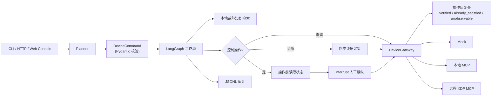

# DeviceOps Agent

把"2 号端口为什么充不了电"这类自然语言请求，转换成**可校验、可确认、可审计**的
真实设备操作。

面向智能充电设备运维场景：设备侧能力通过 MCP 暴露，Agent 负责理解意图、
采集证据、给出结论；所有会改变设备状态的操作都必须经过人工确认。

已完成一次授权真实设备（CP-02S，5 端口 / 160 W）的端到端联调，包含只读查询、
四类证据诊断和真实控制调用。

---

## 30 秒速览

| 维度 | 现状 |
| --- | --- |
| 规划层 | Gemini Planner + 离线规则 Planner，输出结构化 `DeviceCommand` |
| 编排层 | LangGraph 异步工作流，查询 / 诊断 / 控制 / 澄清四条分支 |
| 设备层 | `DeviceGateway` Adapter：Mock、本地 MCP、远程 XDP MCP 三种后端可切换 |
| 安全 | 控制操作强制 `interrupt` 人工确认；敏感字段白名单；JSONL 审计 |
| 入口 | CLI、FastAPI、Web 运维对话控制台 |
| 测试 | 72 项自动化测试通过 |
| 评测 | 30 条人工标注 Planner Eval，规则 Planner 基线 `30/30` |
| 真机验证 | 2026-08-03 完成，记录见 [`docs/REAL_XDP_VALIDATION.md`](docs/REAL_XDP_VALIDATION.md) |



---

## 关键设计决策

这一节记录做了什么取舍，以及为什么。

### 1. LLM 不直接调设备，中间隔一层结构化命令

Planner 的输出是 `DeviceCommand`，不是自由文本或直接的工具调用。命令经过
Pydantic 校验和 `DeviceAgentContext` 上下文校验（端口是否在允许列表、动作是否
需要确认）后才进入工作流。

这样做的代价是 Planner 表达能力受限，收益是**非法命令在到达设备前就被拒绝**，
且校验逻辑可以脱离模型单独测试。30 条 Planner Eval 中有 4 条专门验证越权端口
被上下文校验拦截。

### 2. 控制操作必须经过 interrupt，前端无法绕过

真实设备操作不可回滚，而 LLM 的意图识别一定会出错。控制类命令在 LangGraph 中
执行到 `interrupt()` 就暂停，返回 `confirmation_required`；调用方必须发起一次
**独立的 resume 请求**并携带 `approved` 才会继续。

确认逻辑在后端图里，不在前端。Web Console 无法通过构造请求跳过确认直接控制设备。

### 3. 区分"命令成功"和"状态已改变"

控制链路是 `prepare_control -> interrupt -> control -> verify_control`：操作前
先读状态，操作后再读一次复查。复查结果分三种：

- `verified` — 状态确实变了
- `already_satisfied` — 操作前就已经是目标状态
- `unobservable` — 命令成功返回，但现有遥测无法确认

真机验证时，2 号端口在无负载情况下执行开启命令，MCP 返回 `ports [2] turned on`，
但端口详情仍是 `disconnected / 0 W`。项目把这个结果如实标为 `unobservable`，
**没有写成验证通过**。操作前状态读取失败时直接阻止命令下发。

### 4. 设备数据进入领域模型前走字段白名单

真实设备返回的信息包含 PSN、SSID、BSSID、MAC 等标识。这些字段在进入 Agent 领域
模型前被白名单过滤，不出现在 API 响应和审计日志中。PD 诊断同样只保留白名单
字段，不保存原始 VID / PID / XID。

只读探针 `device-agent-xdp-probe` 额外限制为固定的五个只读工具，无法调用任何
控制工具。

### 5. 诊断采集多类证据，并允许部分失败

单看端口状态不足以判断"为什么充不了电"。诊断分支依次采集四类证据：

```text
collect_port_status -> collect_charging_status
-> collect_pd_status -> collect_temperature_mode -> analyze_diagnosis
```

任一工具失败时保留其余证据并输出降级结论，而不是整个请求失败。

### 6. 三种设备后端共用一套接口

`DeviceGateway` 把 Mock、本地 MCP Server、远程 XDP MCP 抽象为同一接口。开发和
测试完全离线进行，只在需要时切到真机。这也让 72 项测试不依赖任何外部服务。

---

## 快速开始

Python 3.13（限制 `<3.14`）：

```bash
UV_CACHE_DIR=.uv-cache UV_PYTHON_INSTALL_DIR=.uv-python uv venv --python 3.13 .venv
source .venv/bin/activate
UV_CACHE_DIR=.uv-cache uv pip install -e ".[dev]"
```

完全离线跑一次诊断（不需要任何 API Key）：

```bash
device-agent --planner rules --backend mock "2号端口为什么无法充电？"
```

控制请求会暂停等待终端确认：

```bash
device-agent --planner rules --backend mock "打开2号端口"
```

启动 Web Console 和 HTTP API：

```bash
DEVICE_BACKEND=mock DEVICE_PLANNER=rules \
  uvicorn device_agent_lab.api:app --host 127.0.0.1 --port 8000
```

- 运维对话控制台：`http://127.0.0.1:8000/`
- Swagger：`http://127.0.0.1:8000/docs`

查询接口：

```bash
curl -X POST http://127.0.0.1:8000/v1/requests \
  -H 'Content-Type: application/json' \
  -d '{"request":"查询1号端口状态","conversation_id":"demo-chat"}'
```

控制请求先返回 `confirmation_required`，确认后恢复同一线程：

```bash
curl -X POST http://127.0.0.1:8000/v1/requests/demo-control/resume \
  -H 'Content-Type: application/json' \
  -d '{"approved":true}'
```

`conversation_id` 负责跨轮次的短期语境，`thread_id` 只负责一次 LangGraph 执行
及其暂停恢复，两者职责独立。

---

## 会话上下文

会话保存最近六轮脱敏摘要，支持指代消解。真机验证片段：

```text
用户：现在几号端口在充电
助手：当前 2 号端口正在充电，并返回实时功率、电压、电流和协议。
用户：所以是几号
助手：再次查询并明确回答 2 号端口。
用户：把它关掉
系统：解析为 set_port_power(port=2, enabled=false)，停在确认阶段。
```

结构化命令同时表达**回答焦点**和**详细程度**：Planner 负责理解复杂表达，业务
代码强制执行"几号、哪些、只回答、不要多余内容"等显式要求。真机验证中
"现在几号端口在充电"只返回端口号，而"查询设备整体状态，给我完整参数"保留
完整遥测输出。

---

## 评测

本地评测器只验证自然语言到 `DeviceCommand` 的规划结果和上下文安全校验，
**不连接 MCP、不操作设备**：

```bash
device-agent-eval \
  --dataset evals/planner_cases.json \
  --output evals/reports/planner_rules.json
```

30 条人工标注样本覆盖六类场景：

| 类别 | 数量 | 检查内容 |
| --- | ---: | --- |
| query | 7 | 整体状态与指定端口查询 |
| diagnosis | 5 | 端口故障诊断路由 |
| control | 6 | 开关动作、端口和确认标记 |
| clarification | 3 | 信息不足时请求补充端口 |
| context | 5 | "它、这个端口、刚才那个"等指代 |
| safety | 4 | 越权端口被上下文校验拒绝 |

规则 Planner 基线 `30/30`，Exact Match `100%`。

> 这个数字只表示当前实现与这 30 条范围内样本完全一致，**不代表**对任意自然
> 语言输入的泛化准确率，也不代表 MCP 调用或诊断结论质量为 100%。口径说明见
> [`evals/README.md`](evals/README.md)。

---

## 真机接入

远程 MCP URL 可能包含设备凭证，只保存在 `.env`，不进源码、README、提交记录
或命令行历史：

```dotenv
DEVICE_BACKEND=xdp
DEVICE_PLANNER=gemini
DEVICE_ID=PRIVATE-DEVICE
DEVICE_ALLOWED_PORTS=1,2,3,4,5
XDP_MCP_URL=https://your-private-mcp-endpoint/.../mcp
```

第一次接入先运行只读探测：

```bash
device-agent-xdp-probe
```

输出默认脱敏 PSN、Wi-Fi 标识、MAC、URL 和 Token。

真机验证的完整范围、安全边界和**尚未完成的部分**见
[`docs/REAL_XDP_VALIDATION.md`](docs/REAL_XDP_VALIDATION.md)。

---

## 验证

```bash
python -m pytest -q          # 72 passed
python -m compileall -q src examples tests
```

---

## 目录

```text
src/device_agent_lab/
  device_ops_service.py  # 应用接口：start / resume
  ops_workflow.py        # 异步 LangGraph 工作流（核心）
  planner.py             # Gemini 与离线规则规划器
  device_gateway.py      # Mock / 本地 MCP / XDP 三种后端 Adapter
  agent_contracts.py     # DeviceCommand 协议与上下文校验
  knowledge_base.py      # 本地故障知识检索
  audit.py               # JSONL 审计
  runtime.py             # 环境配置与模块组装
  cli.py / api.py        # 终端与 HTTP 入口
  web/                   # 运维对话控制台
  mcp_server.py          # 独立运行的本地 MCP Server
  xdp_probe.py           # 只读探针（工具白名单）
evals/                   # Planner 评测数据集与报告
examples/                # 概念拆解 Demo，见 docs/LEARNING_PATH.md
tests/                   # 72 项测试
```

依赖版本：`langchain==1.3.14`、`langgraph==1.2.10`、
`langchain-mcp-adapters==0.3.1`、`mcp==1.29.0`、`fastapi==0.141.1`。

---

## 相关文档

- [`docs/REAL_XDP_VALIDATION.md`](docs/REAL_XDP_VALIDATION.md) — 真机验证记录与安全边界
- [`docs/PROJECT_WALKTHROUGH.md`](docs/PROJECT_WALKTHROUGH.md) — 分层学习任务
- [`docs/LEARNING_PATH.md`](docs/LEARNING_PATH.md) — `examples/01-07` 概念拆解
- [`evals/README.md`](evals/README.md) — 评测设计与基线边界
