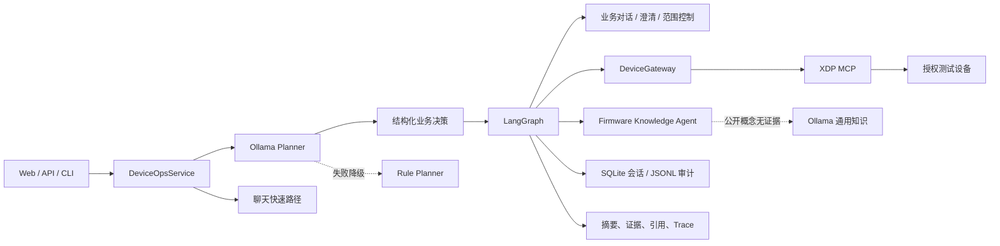

# DeviceOps Agent

面向智能充电设备运维的 AI Agent。它把自然语言请求转换为结构化设备命令，
通过 LangGraph 编排查询、诊断与控制，并接入公司已有 XDP MCP 服务操作经授权
测试设备。诊断链路还会调用独立的 Firmware Knowledge Agent，用实时遥测和业务
文档共同生成结论。

当前冻结版本：`1.6.0`。

## 当前能力

| 层次 | 实现 |
| --- | --- |
| 意图规划 | 明确问候/身份/能力走规则快速路径；其余由 Ollama `llama3.1:8b` 输出 JSON Schema；模型后确定性归一化与规则降级 |
| 动作协议 | Pydantic `DeviceCommand` 统一约束聊天、知识、设备、澄清、范围外请求和控制标记 |
| 工作流 | LangGraph 编排业务对话、直接 RAG、上下文解释、范围控制、设备查询/诊断/控制 |
| 设备接入 | `DeviceGateway` 适配 Mock、本地 MCP、远程 XDP MCP |
| 设备切换 | 私有授权配置、连接前只读验证、原子替换、失败回滚、按设备隔离会话 |
| 知识增强 | 严格 RAG 优先；公开通用概念无证据时可使用带来源标签的 Ollama 降级；具体设备事实仍拒答 |
| 会话 | SQLite 保存脱敏摘要、证据和来源，支持端口指代、“为什么？”及上一条结果解释 |
| 控制验证 | 操作前读状态，执行后轮询复查，区分 verified、already_satisfied、mismatch、unobservable |
| 工程入口 | FastAPI、SSE 流式事件、响应式 Web 运维控制台、CLI、Swagger |
| 交互建议 | 首屏仅显示通用入口；完成回答后按本轮命令、端口和结果生成可执行追问 |
| 可观测性 | 节点 Trace、逐步耗时、模型 token、JSONL 审计、知识引用 |
| 部署 | Docker Compose；已在 macOS OrbStack 验证 |
| 测试 | `147 passed` |

## 架构



### 业务对话与路由

```text
validate
├── respond_chat -> summarize
├── answer_knowledge -> summarize
├── explain_previous -> summarize
├── unsupported -> summarize
└── clarify -> summarize
```

“你是谁”“你能做什么”等明确请求由规则快速返回，不调用 Planner 模型或设备；
固件和协议问题先调用严格 RAG。RAG 无证据时，只有公开通用概念可以降级到
Ollama，并明确标记“未经知识库验证”；具体设备、公司实现和支持能力继续拒答。
PPS 等有跨领域歧义的缩写会先限定到 USB PD 语境，模型答案仍需通过领域校验。
“为什么？”根据 SQLite 中上一条脱敏摘要、证据和来源解释；无关请求返回能力
边界。澄清是正常业务状态，不再显示为设备操作失败。

Web 控制台会在对话中显示当前工作流阶段和耗时，支持停止长请求；设备切换和
手动刷新直接读取脱敏状态快照，不经过 Planner。Trace、知识来源和验证状态在
所有窗口中按需通过执行证据抽屉查看，查询结果同步刷新左侧端口遥测。

### 查询

```text
validate -> query -> summarize
```

### 端口或整机诊断

```text
validate
-> collect_device_status / collect_port_status
-> collect_charging_status
-> collect_pd_status
-> collect_temperature_mode
-> analyze_diagnosis
-> retrieve_knowledge
-> summarize
```

设备事实先采集，RAG 后增强。知识服务不可用时不会伪造成功，也不会丢弃已经取得
的真实遥测，而是在结果中返回降级警告。

### 控制

```text
validate -> prepare_control -> control -> verify_control -> summarize
```

系统支持两种策略：

- `approval`：LangGraph 在 `interrupt()` 暂停，必须通过 resume 批准。
- `automatic`：仅用于本人明确授权的测试设备，后端自动恢复同一工作流。

两种模式都执行端口白名单、操作前读取、操作后轮询验证和审计。自动模式不是跳过
后端校验，只是免去人工批准这一环。

## 快速运行

要求 Python 3.13、Ollama，以及已下载的本地模型：

```bash
ollama pull llama3.1:8b
```

安装：

```bash
UV_CACHE_DIR=.uv-cache uv sync --extra dev
```

离线 Mock：

```bash
DEVICE_BACKEND=mock \
DEVICE_PLANNER=rules \
DEVICE_CONTROL_MODE=approval \
  .venv/bin/uvicorn device_agent_lab.api:app --host 127.0.0.1 --port 8000
```

当前本机真实演示配置保存在被 Git 忽略的 `.env`，其中包含：

```dotenv
DEVICE_BACKEND=xdp
DEVICE_PLANNER=ollama
DEVICE_PLANNER_FALLBACK=true
GENERAL_KNOWLEDGE_FALLBACK=true
DEVICE_CONTROL_MODE=automatic
FIRMWARE_RAG_URL=http://127.0.0.1:8011
```

`XDP_MCP_URL` 可能包含设备凭证，只能留在 `.env`，不得写入源码、截图、简历或
提交记录。

多设备演示时，将 `device_profiles.example.json` 复制到被 Git 忽略的
`var/device-profiles.json`，再替换为每台已授权设备的完整 MCP URL。本地
Python 运行时使用：

```dotenv
DEVICE_PROFILES_FILE=var/device-profiles.json
DEVICE_PROFILE_STATE=var/active-device-profile
```

Docker 中 `var/` 挂载在 `/data`，因此使用：

```dotenv
DEVICE_PROFILES_FILE=/data/device-profiles.json
```

前端只会获得配置 ID、别名、后端类型和端口范围，不会获得
`device_id`、PSN、TOKEN 或 MCP URL。切换时等待当前请求结束，新连接
通过只读状态查询后才替换旧连接；任何失败都保留原设备。

入口：

- 控制台：`http://127.0.0.1:8000/`
- Swagger：`http://127.0.0.1:8000/docs`
- 健康检查：`http://127.0.0.1:8000/health`
- 授权设备列表：`GET http://127.0.0.1:8000/v1/devices`
- 当前设备快照：`GET http://127.0.0.1:8000/v1/devices/current/status`

## API 示例

```bash
curl -X POST http://127.0.0.1:8000/v1/requests \
  -H 'Content-Type: application/json' \
  -d '{"request":"诊断设备整体状态并结合文档给出建议","conversation_id":"demo"}'
```

SSE 流式入口：

```bash
curl -N -X POST http://127.0.0.1:8000/v1/requests/stream \
  -H 'Content-Type: application/json' \
  -d '{"request":"3号端口为什么充电异常","conversation_id":"demo"}'
```

`conversation_id` 标识多轮会话；`thread_id` 标识一次 LangGraph 执行及其
interrupt/resume 生命周期。

## macOS OrbStack 部署

统一编排文件位于 `deploy/compose.yaml`，同时启动 DeviceOps 和 Firmware
Knowledge Agent。先启动 OrbStack 与 Ollama，再执行：

```bash
docker compose -f deploy/compose.yaml build
docker compose -f deploy/compose.yaml up -d
docker compose -f deploy/compose.yaml ps
```

容器通过 `host.docker.internal` 调用宿主机 Ollama。详细步骤和故障排查见
[`docs/MACOS_ORBSTACK_DEPLOYMENT.md`](docs/MACOS_ORBSTACK_DEPLOYMENT.md)。

## 验证结果

- 147 项自动化测试通过。
- 40 条人工标注 Planner Eval 覆盖聊天、知识、范围外请求、上下文、查询、诊断、
  控制、澄清和安全；规则基线 `40/40`。
- 本地 `llama3.1:8b` 使用同一数据集完成真实结构化路由评测，结果见
  `evals/reports/planner_ollama.json`。该结果只代表这组固定样本，不代表开放
  自然语言泛化准确率。
- 另行冻结 18 条未参与实现调试的口语化留出集，首次结果为 Rules `9/18`、
  Ollama `11/18`。失败被保留且未据此调参，用于说明规则兜底与 8B 本地模型的
  泛化边界。
- 授权真机已完成整机查询、端口查询、四类证据诊断、RAG 联动、关闭端口、
  操作后验证、重新开启并恢复充电。
- 本地 Python 链路与 OrbStack 容器链路均完成
  `DeviceOps -> RAG -> Ollama -> XDP MCP -> 真实设备` 验证。
- 桌面和 390 px 移动视口通过浏览器 QA，无横向溢出或控件遮挡。

真实验证边界见
[`docs/REAL_XDP_VALIDATION.md`](docs/REAL_XDP_VALIDATION.md)。

## 测试

```bash
.venv/bin/pytest -q
.venv/bin/python -m compileall -q src tests
node --check src/device_agent_lab/web/app.js
```

## 目录

```text
src/device_agent_lab/
  agent_contracts.py      # 统一业务决策、设备命令与会话协议
  planner.py              # Ollama / Gemini / Rule Planner 与降级
  ops_workflow.py         # LangGraph 核心工作流
  device_gateway.py       # Mock / Local MCP / XDP Adapter
  knowledge_gateway.py    # 严格 RAG 接口与受限通用知识降级
  device_ops_service.py   # start / resume / stream 应用接口
  conversation_store.py   # SQLite 多轮上下文
  metrics.py              # 规划、工作流、节点与 token 指标
  audit.py                # 脱敏 JSONL 审计
  runtime.py              # 环境配置与依赖组装
  api.py                  # FastAPI
  web/                    # 运维控制台
deploy/compose.yaml       # 双项目 OrbStack 编排
evals/                    # Planner Eval
tests/                    # 自动化测试
```

## 项目边界

- 公司已有：XDP MCP Server、设备工具和底层设备协议。
- 本项目实现：Agent 应用层、统一命令协议、LangGraph 工作流、MCP Adapter、
  RAG 联动、会话、控制验证、审计、评测、FastAPI、Web UI 和 Docker 编排。
- 当前是经授权的单设备作品集系统，不声称具备多租户权限、生产级高可用或任意
  设备兼容性。

学习顺序见
[`docs/PROJECT_WALKTHROUGH.md`](docs/PROJECT_WALKTHROUGH.md)。
