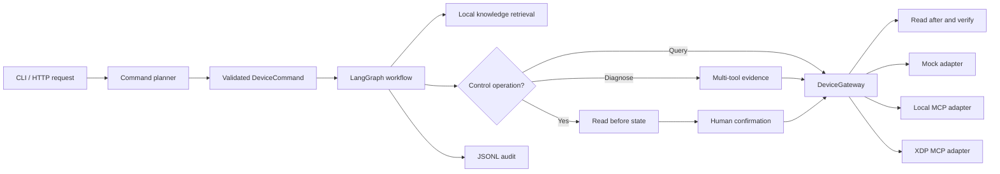

# DeviceOps Agent

这是一个面向智能充电设备运维场景的 AI Agent 项目。它把自然语言请求转换成经过校验的结构化命令，通过 LangGraph 编排查询、知识检索、人工确认、MCP 工具调用和审计记录。

项目可以完全离线运行，也可以切换到本地 MCP Server；公司 `xdp-mcp` 只作为可选远程后端，通过环境变量接入。

## 核心能力

- LangChain Agent / 离线规则规划器生成 `DeviceCommand`。
- 结构化命令同时表达回答焦点和详细程度，支持“只回答端口号”等要求。
- LangGraph 执行校验、知识检索、条件路由、暂停和恢复。
- 会话上下文保存最近六轮脱敏摘要，支持“它、刚才那个端口”等指代。
- `DeviceGateway` 在 Mock、本地 MCP、远程 XDP 之间切换。
- 端口异常请求会采集端口、充电位图、PD 和温度策略四类证据。
- 单项诊断工具失败时保留其他证据并输出降级结论。
- 控制操作先读取状态，经过人工确认后执行并再次复查；查询操作直接执行。
- 本地故障知识检索增强诊断结果。
- 设备运维对话控制台、CLI 和 FastAPI 三种入口。
- JSONL 审计日志记录请求、命令、确认和结果。



## 关键目录

```text
src/device_agent_lab/
  device_ops_service.py  # 正式应用接口：start / resume
  ops_workflow.py        # 异步 LangGraph 工作流
  planner.py             # Gemini 与离线规则规划器
  device_gateway.py      # Mock / MCP 设备 Adapter
  knowledge_base.py      # 本地知识检索
  audit.py               # 审计记录
  runtime.py             # 环境配置和模块组装
  cli.py                 # 终端入口
  api.py                 # FastAPI 与 Web Console 入口
  web/                   # 对话控制台 HTML / CSS / JavaScript
  mcp_server.py          # 独立运行的本地 MCP Server
examples/                # 01-07 学习用 Demo
tests/                   # 单元与应用接口测试
```

## 本地环境

项目使用 Python 3.13，并限制为 `<3.14`。

```bash
cd /Users/ifanr/devlop/Personal_Information/device-agent-lab
UV_CACHE_DIR=.uv-cache UV_PYTHON_INSTALL_DIR=.uv-python uv python install 3.13
UV_CACHE_DIR=.uv-cache UV_PYTHON_INSTALL_DIR=.uv-python uv venv --python 3.13 .venv
source .venv/bin/activate
UV_CACHE_DIR=.uv-cache uv pip install -e ".[dev]"
```

当前已验证的主要依赖版本：

- `langchain==1.3.14`
- `langgraph==1.2.10`
- `langchain-mcp-adapters==0.3.1`
- `mcp==1.29.0`
- `fastapi==0.141.1`

## 运行完整项目

完全离线的诊断查询：

```bash
device-agent --planner rules --backend mock "2号端口为什么无法充电？"
```

该请求会走独立诊断分支：

```text
collect_port_status
-> collect_charging_status
-> collect_pd_status
-> collect_temperature_mode
-> analyze_diagnosis
```

使用 Gemini 生成结构化命令：

```bash
device-agent --planner gemini --backend mock "查询2号端口状态"
```

让正式工作流通过本地 MCP Server 查询设备：

```bash
device-agent --planner rules --backend local_mcp "查询2号端口状态"
```

控制请求会暂停并要求在终端确认：

```bash
device-agent --planner rules --backend mock "打开2号端口"
```

## Web Console 与 HTTP API

启动服务：

```bash
DEVICE_BACKEND=mock DEVICE_PLANNER=rules \
  uvicorn device_agent_lab.api:app --host 127.0.0.1 --port 8000
```

浏览器入口：

- 运维对话控制台：`http://127.0.0.1:8000/`
- Swagger 接口文档：`http://127.0.0.1:8000/docs`

控制台支持自然语言请求、多轮指代、五端口状态、工作流 Trace、结果证据
和控制确认。`conversation_id` 负责短期语境，`thread_id` 只负责一次
LangGraph 执行及控制暂停恢复，两者职责独立。
控制请求仍然由后端 LangGraph `interrupt` 强制暂停，前端不能绕过确认
直接调用设备。

查询：

```bash
curl -X POST http://127.0.0.1:8000/v1/requests \
  -H 'Content-Type: application/json' \
  -d '{"request":"查询1号端口状态","conversation_id":"demo-chat"}'
```

控制请求第一次返回 `confirmation_required`，确认后恢复同一个线程：

```bash
curl -X POST http://127.0.0.1:8000/v1/requests/demo-control/resume \
  -H 'Content-Type: application/json' \
  -d '{"approved":true}'
```

## XDP MCP 接入

完整远程 MCP URL 只保存在 `.env`：

```dotenv
DEVICE_BACKEND=xdp
DEVICE_PLANNER=gemini
DEVICE_ID=PRIVATE-DEVICE
DEVICE_ALLOWED_PORTS=1,2,3,4,5
XDP_MCP_URL=https://your-private-mcp-endpoint/.../mcp
```

然后使用同一个入口：

```bash
device-agent "查询2号端口状态"
```

`XDP_MCP_URL` 可能包含设备凭证，不能写进源码、README、提交记录或命令行历史。远程控制会影响真实设备，先查询状态，并只在终端或 API 中明确确认后执行。

第一次接入时先运行只读探测：

```bash
device-agent-xdp-probe
```

该命令只允许调用 `get_device_info`、`get_machine_facts`、`get_port_details`、`get_charging_status` 和 `get_temperature_mode`，不会调用任何控制工具。输出默认脱敏 PSN、Wi-Fi 标识、MAC、URL 和 Token。

2026-08-03 已完成一次授权真实设备的只读联调、Agent 整体状态查询、
端口查询、四类证据诊断、确认取消分支，以及 2 号端口关闭后恢复开启的
真实控制调用。由于端口没有连接负载，MCP 已接受开启命令，但现有遥测
无法确认使能位变化；项目将该结果明确标为 `unobservable`。验证记录见
[`docs/REAL_XDP_VALIDATION.md`](docs/REAL_XDP_VALIDATION.md)。

同日完成 Web Console 的桌面与 390 × 844 移动端浏览器验收，查询、
确认取消、端口遥测和 Trace 展示均通过。

0.4.0 增加精确设备摘要和短期会话上下文。真实 XDP 验证中：

```text
用户：现在几号端口在充电
助手：当前 2 号端口正在充电，并返回实时功率、电压、电流和协议。
用户：所以是几号
助手：再次查询并明确回答 2 号端口。
用户：把它关掉
系统：解析为 set_port_power(port=2, enabled=false)，停在确认阶段。
```

验证时选择取消，随后“所以它还在充电吗”被解析为
`get_port_status(port=2)`，真实设备仍在充电。

0.5.0 增加结构化回答焦点与详细程度。Gemini Planner 负责理解复杂
表达，业务代码会强制执行“几号、哪些、只回答、不要多余内容”等显式
要求；真实设备验证“现在几号端口在充电”只返回端口号，同时保留
“查询设备整体状态，给我完整参数”的详细遥测输出。当前 72 项自动化
测试通过，规则 Planner 的 30 条离线基线仍为 30/30。

## 验证

```bash
python -m pytest -q
python -m compileall -q src examples tests
```

### Agent Eval

本地评测器只验证自然语言到 `DeviceCommand` 的规划结果和上下文安全
校验，不连接 MCP、不操作设备：

```bash
device-agent-eval \
  --dataset evals/planner_cases.json \
  --output evals/reports/planner_rules.json
```

当前规则 Planner 在 30 条人工标注样本上为 `30/30`，Exact Match
`100%`，覆盖查询、诊断、控制、澄清、多轮指代和越权端口六类场景。
这个数字仅代表当前固定数据集，不代表任意自然语言输入或真实设备链路
具有 100% 准确率。数据说明和完整报告见
[`evals/README.md`](evals/README.md)。

## 学习用 Demo

`examples/01-07` 保留为概念拆解材料。正式项目入口是 `device-agent` 或 `device_agent_lab.api:app`，不再从 Demo 继续堆功能。

完整项目的分层学习任务见 [`docs/PROJECT_WALKTHROUGH.md`](docs/PROJECT_WALKTHROUGH.md)。

## 课件同款最小 Agent demo

这个 demo 对应课程里“构建一个基本的 Agent：模型、工具、提示词”。

```bash
cd /Users/ifanr/devlop/Personal_Information/device-agent-lab
source .venv/bin/activate
python examples/01_basic_agent.py
```

如果没有配置 `GEMINI_API_KEY`，脚本会跳过真实模型调用。

## 上下文与结构化响应 demo

这个 demo 对应课程里“构建真实 Agent”的前半部分：添加上下文、约束 Agent 输出格式。

```bash
cd /Users/ifanr/devlop/Personal_Information/device-agent-lab
source .venv/bin/activate
python examples/02_context_and_schema.py
```

它不会直接控制设备，而是先让 Agent 输出一个结构化动作：

```json
{
  "intent": "control_device",
  "action": "set_port_power",
  "device_id": "DEMO-CP02-001",
  "port": 2,
  "enabled": true,
  "need_confirmation": true,
  "reason": "用户请求打开设备的2号端口。"
}
```

这一步的重点是把“聊天回复”变成“业务代码可以校验和执行的动作”。

相关文件：

- `examples/02_context_and_schema.py`: demo 入口。
- `src/device_agent_lab/agent_contracts.py`: 设备上下文、结构化命令和校验规则。

## 结构化动作执行 demo

这个 demo 在 02 的基础上继续前进一步：把 Agent 生成的 `DeviceCommand` 交给 mock 设备执行。

```bash
cd /Users/ifanr/devlop/Personal_Information/device-agent-lab
source .venv/bin/activate
python examples/03_execute_device_command.py
```

运行流程：

```text
用户自然语言
-> Agent 输出 DeviceCommand
-> 业务代码校验命令
-> 控制类命令先等待确认
-> 确认后调用 mock 设备控制接口
```

相关文件：

- `examples/03_execute_device_command.py`: demo 入口。
- `src/device_agent_lab/command_executor.py`: 把结构化命令转换成设备操作。
- `src/device_agent_lab/mock_device.py`: mock 设备状态和控制逻辑。

## 短期记忆 demo

这个 demo 在 03 的基础上加入短期记忆：同一个 `thread_id` 下，Agent 能看到上一轮对话。

```bash
cd /Users/ifanr/devlop/Personal_Information/device-agent-lab
source .venv/bin/activate
python examples/04_short_term_memory.py
```

运行流程：

```text
第 1 轮：用户说“查看 2 号端口状态”
-> Agent 输出 get_port_status / port=2
-> 业务代码返回 mock 端口状态

第 2 轮：用户说“把它打开”
-> InMemorySaver 按 thread_id 提供上一轮对话
-> Agent 知道“它”指的是 2 号端口
-> Agent 输出 set_port_power / port=2 / enabled=true
-> 业务代码确认后更新 mock 设备状态
```

相关文件：

- `examples/04_short_term_memory.py`: demo 入口。
- `langgraph.checkpoint.memory.InMemorySaver`: 内存版短期记忆。
- `thread_id`: 区分不同对话线程。

## MCP 工具调用 demo

这个 demo 把设备能力切到 MCP 工具层：Agent 不再直接调用 `mock_device.py`，而是通过本地 MCP server 发现并调用设备工具。

```bash
cd /Users/ifanr/devlop/Personal_Information/device-agent-lab
source .venv/bin/activate
python examples/05_mcp_tools_agent.py
```

运行流程：

```text
启动本地 MCP server 子进程
-> MultiServerMCPClient 发现 MCP tools
-> 直接调用一次 device_get_port_status 验证工具层
-> Agent 接收 MCP tools
-> 用户确认打开 2 号端口
-> Agent 选择 device_set_port_power
-> MCP server 调用 mock 设备并返回状态
```

相关文件：

- `examples/05_mcp_tools_agent.py`: demo 入口。
- `src/device_agent_lab/mcp_client_config.py`: 本地 MCP stdio 连接配置。
- `src/device_agent_lab/mcp_server.py`: MCP server，暴露设备查询和控制工具。

第一版工具：

- `device_get_status`: 查询设备整体状态。
- `device_get_port_status`: 查询指定端口状态。
- `device_set_port_power`: 设置指定端口开关和功率。

## LangGraph 基础学习：06A-D

第一次学习 LangGraph 时，不要直接进入完整设备工作流。先按 A-D 顺序运行四个自包含示例，每个文件只增加一个核心概念，而且都不需要 API Key。

### 06A：最小状态图

只学习 `State`、`Node`、`Edge`、`START`、`END` 和 `invoke()`。

```bash
python examples/06a_minimal_graph.py
```

```text
START -> add_one -> END
```

### 06B：条件路由

在 06A 基础上增加 `add_conditional_edges()`，根据 State 进入查询或控制分支。

```bash
python examples/06b_conditional_routing.py
```

```text
START -> route_request -> query   -> END
                       -> control -> END
```

### 06C：共享状态和局部更新

学习多个节点如何读取同一份 State、只返回需要更新的字段，以及 `Annotated[..., operator.add]` 如何累加 `trace`。

```bash
python examples/06c_shared_state.py
```

```text
START -> normalize -> query -> summarize -> END
```

### 06D：暂停和恢复

最后才加入 `InMemorySaver`、`thread_id`、`interrupt()` 和 `Command(resume=...)`。这个例子只更新执行状态，不接真实设备。

```bash
python examples/06d_interrupt_resume.py
```

学习要求：先能解释当前文件的 State、每个节点输入输出和连线，再进入下一节；不要求背诵 API。

## LangGraph 设备控制综合 demo

学完 06A-D 后，再回到这个综合 demo。它把条件分支、共享状态、人工确认和前面的 `DeviceCommand`、mock 设备组合起来。

```bash
cd /Users/ifanr/devlop/Personal_Information/device-agent-lab
source .venv/bin/activate
python examples/06_langgraph_workflow.py
```

控制流程：

```text
START
-> validate
-> control
-> interrupt：暂停并等待人工确认
-> Command(resume=True)：恢复原工作流
-> summarize
-> END
```

图中有三条分支：

- 查询命令：`validate -> query -> summarize`。
- 控制命令：`validate -> control -> interrupt -> summarize`。
- 信息不足：`validate -> clarify -> summarize`。

相关文件：

- `examples/06_langgraph_workflow.py`: demo 入口，构造命令并演示暂停、恢复。
- `src/device_agent_lab/device_workflow.py`: LangGraph 的 State、节点、条件边和 checkpointer。
- `tests/test_device_workflow.py`: 查询、确认、拒绝和澄清分支测试。

这里的 `DeviceCommand` 可以理解为前面 Agent 已经完成的决策结果。LangGraph 负责控制这个结果接下来经过哪些业务步骤，尤其保证控制动作不会在确认前执行。

## Agent + LangGraph 整合 demo

07 把 02 和 06 接成一条完整链路：Gemini 先把自然语言转换成 `DeviceCommand`，再由 LangGraph 负责校验、路由、人工确认和设备执行。

```bash
cd /Users/ifanr/devlop/Personal_Information/device-agent-lab
source .venv/bin/activate
python examples/07_agent_to_langgraph.py
```

默认请求是“打开 2 号端口”，运行到控制节点后会在终端询问是否确认。输入 `y` 才会修改 mock 设备；直接回车或输入其他内容会取消操作。

也可以通过环境变量测试查询分支，查询不会要求确认：

```bash
DEVICE_REQUEST="查询2号端口状态" python examples/07_agent_to_langgraph.py
```

运行流程：

```text
用户自然语言
-> LangChain Agent
-> DeviceCommand
-> LangGraph validate
-> query / control / clarify
-> 控制操作 interrupt 等待终端确认
-> mock 设备执行
-> summary
```

相关文件：

- `examples/07_agent_to_langgraph.py`: 整合入口和终端确认回调。
- `src/device_agent_lab/agent_contracts.py`: Agent 的上下文与结构化输出协议。
- `src/device_agent_lab/device_workflow.py`: LangGraph 设备工作流。
- `src/device_agent_lab/mock_device.py`: 当前设备执行后端。

07 仍然是教学版整合示例，只使用本地 mock。正式项目已经在 `ops_workflow.py`、`device_gateway.py` 和 `device_ops_service.py` 中完成异步 MCP、知识检索、审计以及 CLI/API 接入。

建议按以下顺序学习正式项目：

1. 用 `device-agent --planner rules --backend mock` 跑查询和控制。
2. 阅读 `device_ops_service.py`，理解 `start()` 和 `resume()`。
3. 阅读 `ops_workflow.py`，画出节点、状态和条件路由。
4. 阅读 `device_gateway.py`，比较 Mock、本地 MCP 和 XDP 映射。
5. 把一个故障知识条目改成自己的内容并验证检索结果。
6. 新增一个只读设备动作，并补对应测试。
