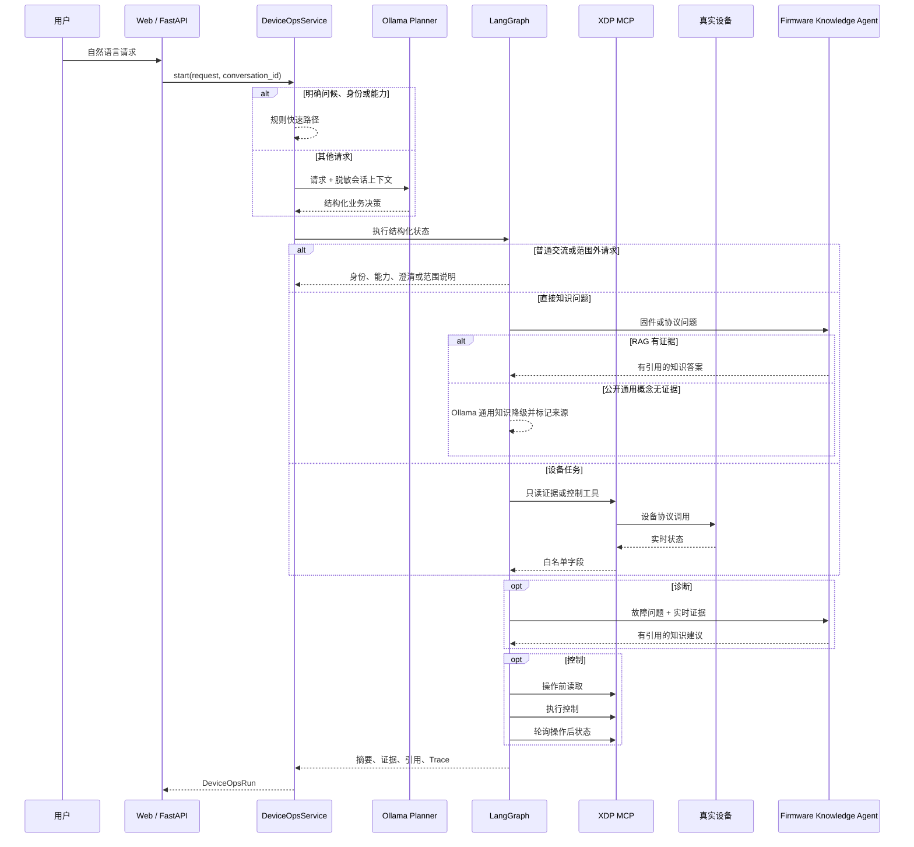

# DeviceOps Agent 逆向学习手册

这份文档用于项目完成后的学习。目标不是逐行背诵，而是能画出链路、解释关键取舍、
独立改一个小功能，并诚实回答本人实现与公司已有能力的边界。

## 学习方法

每一阶段只做五件事：

```text
先运行 -> 画输入输出 -> 阅读指定文件 -> 口述设计 -> 做一个小修改并跑测试
```

不要先读完整源码。优先掌握一条能演示、能排障、能回答追问的主链路。

## 0. 先记住完整链路



## 1. 会演示

入口：

```text
http://127.0.0.1:8000/
```

按顺序输入：

1. `你是谁，你能做什么`
2. `ESP32 Remote PD PHY 不支持哪些能力？`
3. `诊断设备整体状态并结合文档给出建议`
4. `现在有哪些端口在充电，只告诉我端口号`
5. `详细诊断3号端口并结合文档分析`
6. `为什么？`
7. `关闭3号端口`
8. `打开3号端口`

前六条展示业务对话、直接知识路由、查询、整机/端口诊断、回答焦点、RAG 引用
和会话解释；后两条只允许在本人授权测试设备上演示，并检查 `verify_control`
的结果。结束后确认端口已恢复。

能回答：

- 左侧设备遥测来自 XDP MCP，不是模型编造。
- 明确的问候、身份和能力说明走规则快速路径；其余普通交流由结构化规划给出
  受约束回复。设备事实仍由工作流根据工具结果汇总，模型不能提前声称工具已执行。
- 右侧 Trace 是 LangGraph 已执行节点。
- 知识建议优先来自独立 RAG API；公开概念的通用模型降级会显示独立来源标签。

## 2. 结构化命令与 Planner

阅读：

- `src/device_agent_lab/agent_contracts.py`
- `src/device_agent_lab/planner.py`
- `tests/test_planner.py`

关键认识：

1. 模型不直接拿到设备客户端，而是输出结构化业务决策。
2. Ollama 使用 JSON Schema 约束结果；业务归一化再次强制设备 ID、端口和控制规则。
3. 明确聊天先走规则快速路径；其余顶层动作覆盖知识、解释、范围外请求、设备任务和澄清；
   `FallbackCommandPlanner` 在模型失败时切换规则 Planner。
4. 用户说“只告诉我端口号”或“详细分析”会映射为回答焦点和详细程度。
5. Pydantic 验证通过不代表业务允许执行，`DeviceAgentContext` 还会检查设备、
   端口白名单和在线状态。

练习：新增一种“端口几正在工作”的表达，在规则 Planner 测试中先写期望，再实现。

## 3. 应用服务与两种 ID

阅读：

- `src/device_agent_lab/device_ops_service.py`
- `src/device_agent_lab/conversation_store.py`
- `tests/test_device_ops_service.py`
- `tests/test_conversation_store.py`

关键认识：

- `conversation_id`：跨请求的对话上下文，SQLite 持久化。
- `thread_id`：一次 LangGraph 执行，以及可能发生的 interrupt/resume。
- 会话只保存脱敏摘要、关键证据、引用标题、最近端口和充电端口，不保存完整 MCP
  响应或凭证。
- “为什么？”从上一条会话记录解释；“它”优先解析为最近唯一端口。
- `start_stream()` 逐节点输出 SSE；最终 `run` 从权威图状态构造，而不是拼接增量。

练习：重启服务后继续同一个 `conversation_id`，验证“把它打开”仍能解析最近端口。

## 4. LangGraph 状态与路由

阅读：

- `src/device_agent_lab/ops_workflow.py`
- `tests/test_ops_workflow.py`

先画 `DeviceOpsState` 中的四组数据：

1. 输入：`command`、`context`。
2. 设备证据：整机、端口、充电、PD、温度。
3. 知识证据：RAG 回答、来源、降级警告。
4. 输出：摘要、验证结果、Trace、节点耗时。

九条业务分支：

```text
chat:
validate -> respond_chat -> summarize

knowledge:
validate -> answer_knowledge -> RAG 或受限通用知识降级 -> summarize

explain:
validate -> explain_previous -> summarize

unsupported:
validate -> unsupported -> summarize

query:
validate -> query -> summarize

diagnose_port:
validate -> collect_port_status -> collect_charging_status
-> collect_pd_status -> collect_temperature_mode
-> analyze_diagnosis -> retrieve_knowledge -> summarize

diagnose_device:
validate -> collect_device_status -> collect_charging_status
-> collect_pd_status -> collect_temperature_mode
-> analyze_device_diagnosis -> retrieve_knowledge -> summarize

control:
validate -> prepare_control -> control -> verify_control -> summarize

clarify:
validate -> clarify -> summarize
```

工具失败被保存为结构化失败证据，诊断尽量继续收集其他信息。只有真正无法安全
执行的控制前置条件才会阻止控制。

练习：让 PD 工具抛错，确认端口、充电和温度证据仍出现在结果中。

## 5. MCP Adapter 与职责边界

阅读：

- `src/device_agent_lab/device_gateway.py`
- `src/device_agent_lab/mcp_client_config.py`
- `tests/test_device_gateway.py`

`DeviceGateway` 是工作流唯一依赖的设备接口：

```text
MockDeviceGateway     -> 单元测试与离线演示
McpDeviceGateway      -> 本地 MCP 教学服务
XdpMcpDeviceGateway   -> 公司已有远程 XDP MCP
```

个人项目没有重写公司 MCP Server。个人实现的是 Adapter、参数映射、返回值归一化、
字段白名单、失败收口，以及 MCP 之上的 Agent 工作流。

原始设备返回可能含 PSN、SSID、MAC、PD 标识等信息。进入领域状态前只保留业务
需要的字段，日志与 API 不应出现完整私有 URL。

练习：给 Mock 返回加入一个敏感字段，写测试证明 API 和审计里看不到它。

## 6. 控制与最终一致性

阅读：

- `ops_workflow.py` 中 `prepare_control`、`control`、`verify_control`
- `src/device_agent_lab/runtime.py`
- 对应工作流与 API 测试

控制不是“工具返回成功就算成功”：

```text
读取 before
-> approval 模式暂停，或 automatic 模式自动 resume
-> MCP 控制
-> 延迟并轮询 after
-> 分类 verification
```

状态：

- `verified`：观察值符合目标。
- `already_satisfied`：操作前已满足目标。
- `mismatch`：轮询结束仍不符合目标。
- `unobservable`：现有遥测不能观察开关使能位。
- `error`：操作后读取失败。

真实设备曾出现 MCP 已返回、立即读取仍是旧状态，说明设备链路存在异步收敛。项目
因此增加可配置轮询，而不是通过 Prompt 掩盖。

## 7. RAG 联动

阅读：

- `src/device_agent_lab/knowledge_gateway.py`
- `ops_workflow.py` 中 `retrieve_knowledge`
- `tests/test_knowledge_gateway.py`

DeviceOps 不把 RAG 代码复制进来，而是调用：

```text
POST http://firmware-rag:8011/v1/agent/answer
```

这样两个项目可以独立运行、测试和写简历，又能在演示中串联。固件概念问题直接
进入 RAG；诊断问题先加入已验证设备事实，再检索相应故障文档。返回答案、引用
和 Trace。远端失败时使用明确的本地故障建议并设置降级标记。

练习：停掉 8011，再做诊断；说明哪些数据仍真实可用，哪些能力发生降级。

## 8. API、UI 与可观测性

阅读：

- `src/device_agent_lab/api.py`
- `src/device_agent_lab/web/app.js`
- `src/device_agent_lab/metrics.py`
- `src/device_agent_lab/audit.py`

重点：

- FastAPI 只负责协议、生命周期与错误映射，业务逻辑复用 Service。
- UI 不直接调用 MCP，不保存密钥。
- SSE 每完成一个图节点就更新 Trace。
- 自动控制由后端策略决定，不能通过前端参数临时绕过。
- 一次自动控制的 metrics 合并规划与自动 resume 两段执行，避免只记录半条链路。
- token 可以记录；费用只有配置单价后才计算。

## 9. 评测与测试

阅读：

- `evals/planner_cases.json`
- `src/device_agent_lab/evaluation.py`
- `evals/README.md`
- `tests/`

两类验证不能混淆：

- `147` 项 pytest：代码行为、错误分支和接口回归。
- `40` 条 Planner Eval：聊天、知识、范围外、上下文和设备动作的结构化路由。

`40/40` 是规则 Planner 的确定性基线。Ollama 使用同一数据集单独评测；两者都
不等于任意表达上的准确率，也不等于诊断或 MCP 成功率。

18 条口语化留出集在实现完成后冻结，首次结果为 Rules `9/18`、Ollama
`11/18`。这些失败未用于继续调参，用来说明规则兜底和本地 8B 模型的泛化边界。

## 10. Docker 与运行配置

阅读：

- `Dockerfile`
- `deploy/compose.yaml`
- `docs/MACOS_ORBSTACK_DEPLOYMENT.md`
- `.env.example`

能解释：

- 两个服务为什么分容器。
- 为什么容器通过 `host.docker.internal` 调用宿主 Ollama。
- 为什么私有语料用挂载而不进镜像。
- 为什么嵌入式 Qdrant 当前只启动一个 worker。
- 为什么 `.env.example` 默认审批，而本人私有测试环境可以显式设为自动。

## 面试最低验收

1. 三分钟讲清用户请求到真实设备的完整链路。
2. 不看代码画出顶层业务路由和设备子工作流。
3. 解释 MCP Server 是公司已有，个人项目具体实现了什么。
4. 解释为什么不能把模型直接连到设备工具。
5. 解释 automatic 与 approval 的边界。
6. 解释 MCP 返回成功为什么还要轮询验证。
7. 解释 RAG 挂掉后系统如何降级。
8. 根据一次 Trace 定位 Planner、MCP、RAG 或设备收敛问题。
9. 独立增加一个只读动作或一条 Planner Eval。
10. 明确说出项目仍是单设备作品集系统，不冒充生产平台。
