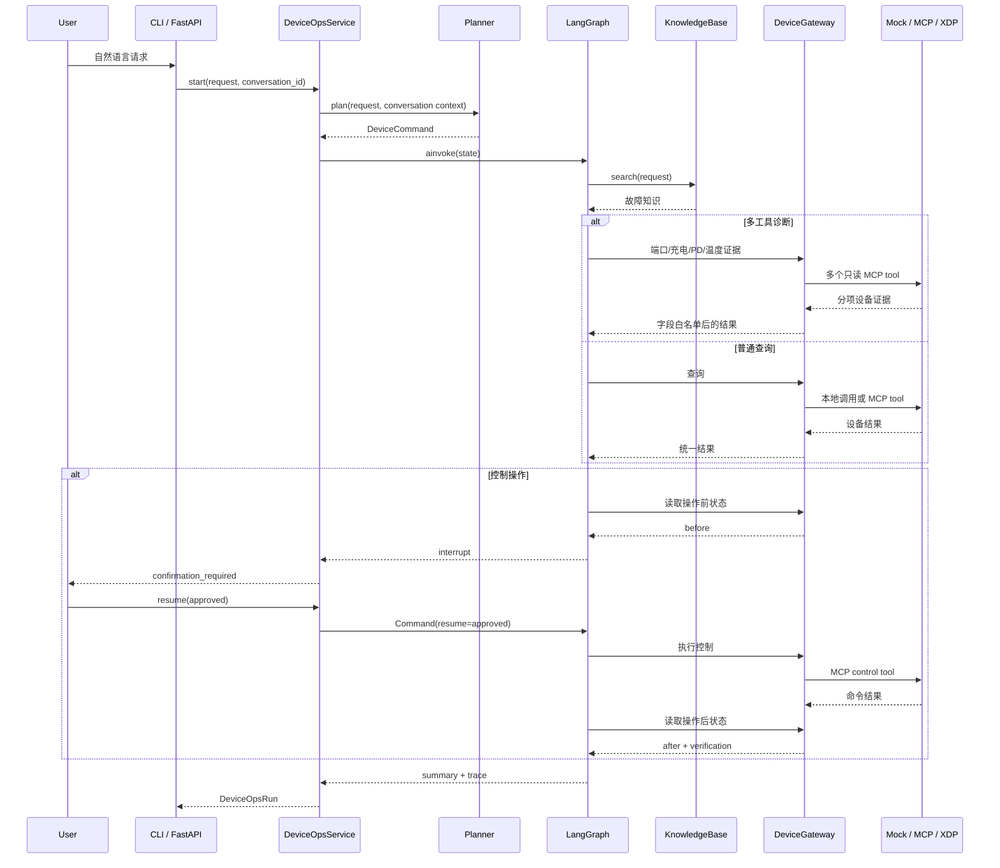

# DeviceOps Agent 学习顺序

这份文档用于项目完成后的逆向学习。目标不是逐行背代码，而是能够解释链路、修改功能并定位问题。

## 总链路



## 第一阶段：先会运行

浏览器入口：

```text
http://127.0.0.1:8000/
```

命令：

```bash
device-agent --planner rules --backend mock "查询2号端口状态"
device-agent --planner rules --backend mock "打开2号端口"
device-agent --planner rules --backend local_mcp "查询2号端口状态"
```

验收：

- 能指出三条命令分别是否使用模型、MCP 和人工确认。
- 能解释为什么控制请求第一次没有修改设备。
- 能在控制台指出自然语言、结构化命令、Trace、证据和确认分别来自哪一层。

## 第二阶段：理解应用接口

阅读：

- `src/device_agent_lab/device_ops_service.py`
- `tests/test_device_ops_service.py`

重点：

- `start()` 为什么同时负责规划和首次执行。
- `resume()` 为什么只需要 `thread_id` 和确认结果。
- `DeviceOpsRun` 为什么区分 `completed` 与 `confirmation_required`。
- `conversation_id` 为什么保存多轮语境，而 `thread_id` 只标识一次执行。
- 会话为什么只保存脱敏摘要、最近端口和充电端口，不保存原始 MCP 响应。

练习：先问“几号端口在充电”，再说“把它关掉”，观察 Planner 如何
根据会话上下文生成带端口号的结构化控制命令。

## 第三阶段：理解 LangGraph

阅读：

- `src/device_agent_lab/ops_workflow.py`
- `tests/test_ops_workflow.py`

按顺序说明每个节点：

```text
validate -> retrieve -> query/diagnose/control/clarify -> summarize
```

诊断请求需要额外说明：

```text
validate
-> retrieve
-> collect_port_status
-> collect_charging_status
-> collect_pd_status
-> collect_temperature_mode
-> analyze_diagnosis
-> summarize
```

控制请求需要额外说明：

```text
validate
-> retrieve
-> prepare_control
-> control (interrupt / resume)
-> verify_control
-> summarize
```

`verification.status` 的含义：

- `verified`：操作后状态变化并符合目标。
- `already_satisfied`：操作前状态已经符合目标。
- `unobservable`：命令成功，但当前遥测无法观察使能状态。
- `mismatch`：命令返回后状态与目标不一致。
- `error`：命令已返回，但操作后状态读取失败。

练习：让控制请求选择拒绝，确认设备状态没有变化；再让操作后查询失败，
确认工作流不会重复下发控制命令。

## 第四阶段：理解 MCP Adapter

阅读：

- `src/device_agent_lab/device_gateway.py`
- `src/device_agent_lab/mcp_client_config.py`
- `tests/test_device_gateway.py`

重点：

- `DeviceGateway` 是工作流依赖的唯一设备接口。
- `MockDeviceGateway` 直接调用内存设备。
- `McpDeviceGateway` 把统一接口映射到不同 MCP 工具名称和参数。
- XDP 的复杂性被限制在 Adapter 内，没有进入 LangGraph。
- 原始 PD 数据为什么必须经过字段白名单后才能进入工作流和审计。

练习：让 PD 工具返回错误，观察诊断如何保留其他三类证据并降级。

## 第五阶段：理解 Agent 与检索

阅读：

- `src/device_agent_lab/planner.py`
- `src/device_agent_lab/knowledge_base.py`
- `src/device_agent_lab/knowledge/*.json`

重点：

- Gemini 与规则规划器都输出同一个 `DeviceCommand`。
- 模型不能绕过 Pydantic 命令协议和上下文校验。
- 检索结果进入工作流状态，并增强最终诊断摘要。

练习：新增一个“端口反复断连”知识条目并补测试。

## 第六阶段：理解工程入口

阅读：

- `src/device_agent_lab/runtime.py`
- `src/device_agent_lab/cli.py`
- `src/device_agent_lab/api.py`
- `src/device_agent_lab/web/app.js`
- `src/device_agent_lab/audit.py`

重点：

- 环境变量如何决定 Planner 和 Gateway。
- CLI 与 FastAPI 为什么复用同一个 `DeviceOpsService`。
- Web Console 为什么只负责交互和展示，不直接连接 MCP。
- 审计日志为什么不记录 MCP URL 和模型密钥。

## 第七阶段：理解 Agent Eval

阅读：

- `evals/planner_cases.json`
- `src/device_agent_lab/evaluation.py`
- `evals/reports/planner_rules.json`
- `tests/test_evaluation.py`

重点：

- 为什么 Agent Eval 检查的是 `action`、端口、开关、确认和上下文校验。
- 为什么单元测试通过不等于 Agent 对自然语言的规划质量可靠。
- 为什么 `30/30` 只能说明固定评测集，不是任意输入准确率。
- 为什么评测 Planner 时不应该连接 MCP 或控制真实设备。

练习：新增五条表达方式不同或故意含糊的请求，先写期望结果，再运行
`device-agent-eval`，分析失败来自规则覆盖、上下文不足还是安全校验。

最终验收：

1. 不看代码画出一次请求的完整链路。
2. 独立新增一个只读动作。
3. 解释为什么要把 XDP 放在 Adapter 后面。
4. 解释 `conversation_id`、`thread_id` 和 `interrupt` 的不同职责。
5. 能根据 `trace` 和审计记录定位失败节点。
